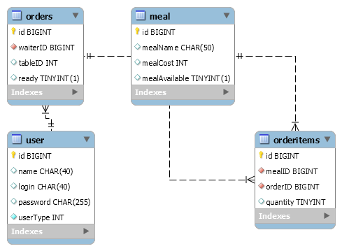

# RESTaurant Companion (server)

This application build according the software constructing course in 2020 autumn. The main goals of making this server
to get know how to build REST-ful API and how to use rules of REST for making web applications. I made the server for
application called RESTaurant companion, which can be used for administrating the orders in cafes, restaurants or
somewhere like that.

## Content

- [Introduction](#restaurant-companion-server)
- [Content](#content)
- [Building database](#building-database)
- [RESTful web-server](#restful-web-server)
    - [RESTaurant Companion](#restaurant-companion)
    - [Read more](#read-more-about-spring-and-rest-api)
- [Client web-application](#client-web-application)
- [Developing yourself](#developing-yourself)

## Building database

I used MySQL 8.0 as my SQL-server

> 
>
> The ER-diagram of database

❕I used INT to represent enum value from user class:

```mysql
CREATE TABLE IF NOT EXISTS `user`
(
    id         SERIAL PRIMARY KEY,
    `name`     CHAR(40),
    `login`    CHAR(40),
    `password` CHAR(255),
    `userType` INTEGER DEFAULT 0 NOT NULL
) comment = 'Basic user entity';
```

❗For running Java code you will need to create user (my database is called `restaurant`):

```mysql
GRANT ALL ON restaurant.* TO 'rest_comp'@'localhost' IDENTIFIED WITH sha256_password BY 'password';
```

You can find SQL-script used for building the database [here](src/main/resources/schema.sql).

## RESTful web-server

❕You can use [Postman](https://www.postman.com/) for testing your REST API

### RESTaurant Companion

### Read more about Spring and REST API

[Spring Guide](https://www.marcobehler.com/guides/spring-framework)

[Architectural Styles and the Design of Network-based Software Architectures. Roy Thomas Fielding](https://www.ics.uci.edu/~fielding/pubs/dissertation/rest_arch_style.htm)

## Client web-application

You can find client web application [here](https://github.com/SirojiddinSaidmurodov/RESTaurantCompanion-client)

## Developing yourself

❗ For running RESTful server you need any SQL server running on your machine (or sql-server on a container if you're
running Docker)

### Running

1. Install MySQL or any other SQL-server. Run the [schema.sql](src/main/resources/schema.sql) and create
   user `rest_comp` with the password `password`.

2. Make sure that you have [JRE](https://www.java.com/ru/download/manual.jsp).

3. Download the latest JAR package
   from [releases](https://github.com/SirojiddinSaidmurodov/RESTaurantCompanion-server/releases) and run.

### Development

You will need the JDK 14.

1. Clone the repository.
   
2. Open in IntelliJ IDEA.