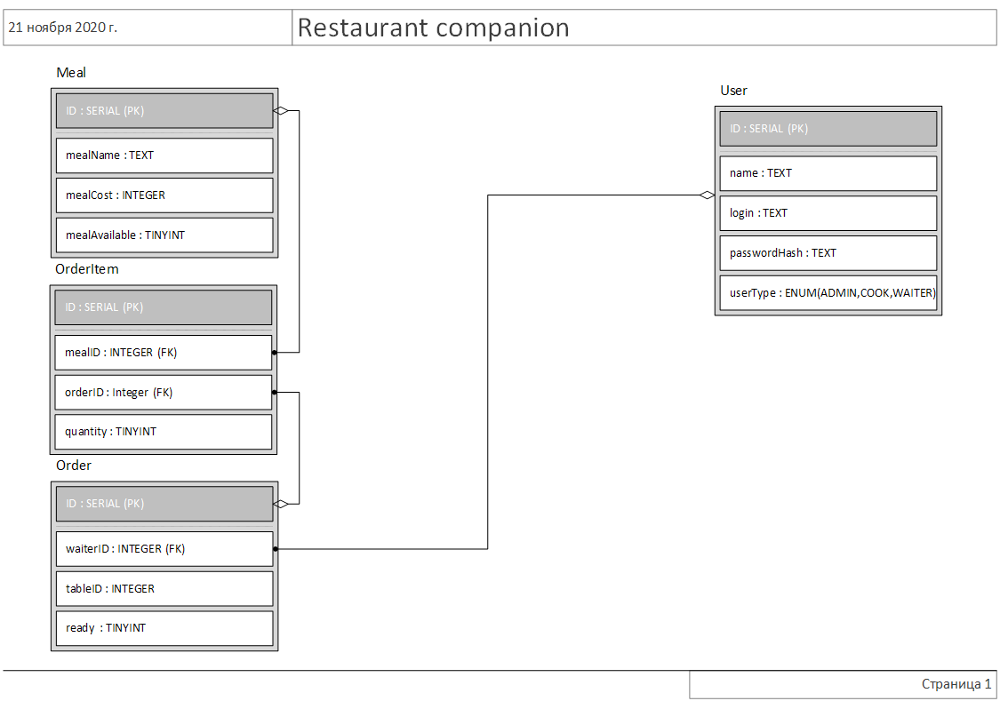

# Software-Construction course

## Content
- [Content](#content)
- [Building database](#building-database)
- [RESTful web-server](#restful-web-server)
    - [RESTaurant Companion](#restaurant-companion)
    - [Read more](#read-more-about-spring-and-rest-api)
- [Client web-application](#client-web-application)
- [Developing yourself](#developing-yourself)
## Building database

>
>This is the ER-diagram of database

You can find SQL-script used for building the database [here](src/main/resources/schema.sql).

## RESTful web-server

### RESTaurant Companion

### Read more about Spring and REST API
https://www.marcobehler.com/guides/spring-framework

## Client web-application

## Developing yourself
❗ For running RESTful server you need any SQL server running on your machine (or sql-server on a container if you're running Docker)
### Database
